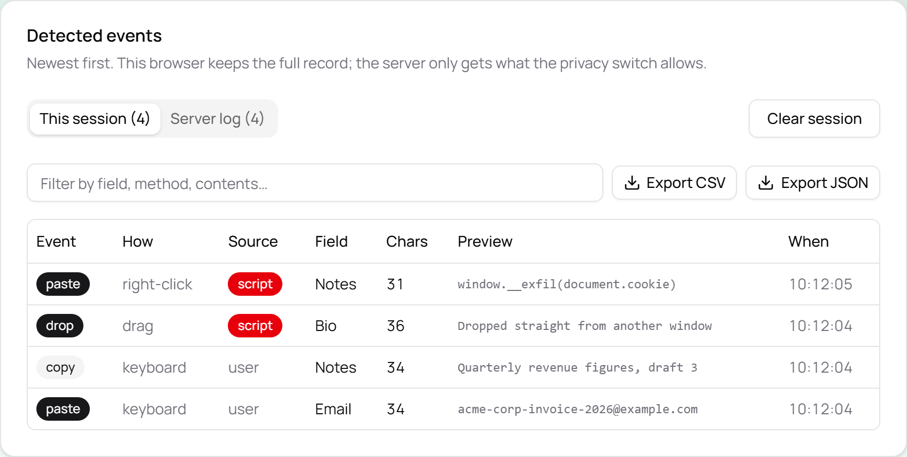

# cp-detection

Detects **copy, cut, paste and drag-drop on any input on the page**, raises a toast for each one, and
keeps a searchable log — including _how_ the paste was triggered (Ctrl+V, right-click menu, or a
drag).

**Live demo: <https://cp-detection.vercel.app>** — open it, paste anything, then check
[/events](https://cp-detection.vercel.app/events).

TanStack Start · React 19 · shadcn/ui · Tailwind 4 · TanStack Router / Query / Table / Store.

<picture>
  <source media="(prefers-color-scheme: dark)" srcset="docs/images/events-log-dark.png">
  
</picture>

That screenshot is the product in one table: the paste in the top row never touched a paste handler —
it was dispatched by a script, and the `Source` column says so.

---

## Quick start

```powershell
pwsh ./setup.ps1     # fresh PC: Node, pnpm, just, Claude Code, deps, Chromium
just start           # http://localhost:3000
```

`setup.ps1` needs **no Administrator and no VPN** — nothing installs a service and everything comes
from public sources. It is idempotent, so re-running it is safe.

Already have Node, pnpm and just? Skip straight to:

```bash
just install
just start
```

---

## What it does

`/` — a landing page that explains the thing, with the playground embedded in it: a hero, "How it
works", what the page does with your clipboard, the fields themselves, then an FAQ.

The playground is a set of ordinary fields:

| Field              | Why it's there                                               |
| ------------------ | ------------------------------------------------------------ |
| `#email`, `#notes` | plain input and textarea                                     |
| `#bio`             | a `contenteditable` region                                   |
| `#confirm-email`   | **protected** — refuses pasted text and says so              |
| `#referral`        | rendered by a component with **no paste handler of its own** |

That last one is the point. Detection is a single document-level listener in the capture phase, so
it catches pastes into fields the app never wired up — including third-party widgets and components
that call `stopPropagation()`. A spec fails if anyone adds a handler to it.

`/events` — every detected event in a TanStack Table, newest first, with tabs for this browser
session and for the server log.

Each event records: type, method, **source** (`user` or `script`), target label, character count, a
truncated preview, and a timestamp.

Either tab exports as **CSV or JSON** — a dated file, built entirely in the browser, holding exactly
what that tab shows. The CSV quotes per RFC 4180 and defuses spreadsheet formula injection (a
clipboard is attacker-controlled by definition, and Excel executes any cell starting with `=`), and
both formats re-cut every preview at the client's 240-character boundary rather than trusting the
store to have done it — the same stance the server takes towards the client.

Settings on the playground: block paste on protected fields, send excerpts to the server, keep
toasts until dismissed, how many seconds a toast stays (1–60), and dismiss-all.

### `user` vs `script`

Every record carries the browser's `Event.isTrusted` — true for a genuine user action, false for
anything a script dispatched. It's the first thing a real anti-fraud or exam platform checks. Here
it's **recorded, not filtered**: a scripted paste is the row you most want to see, so hiding it
would defeat the point. An acceptance spec pastes both ways and asserts the log tells them apart.

**Not covered:** simulated-keystroke tools (ForcePaste and similar) replay the clipboard as
individual keystrokes, so no `paste` event and no `insertFromPaste` ever fires. Nothing in the
clipboard APIs can see that — catching it needs keystroke-timing analysis, which is deliberately out
of scope here.

---

## How paste provenance works

There is **no browser API** that tells you whether a paste came from Ctrl+V, the right-click menu, or
a drag. It has to be inferred from event timing.

That inference lives in `src/lib/attribution.ts`, which is **pure** — it takes plain `{kind, at}`
records with an injected clock, never DOM events and never `Date.now()`. `src/lib/clipboard-detector.ts`
is a thin adapter that turns listeners into those records.

Keep that split. Merging them makes the hard logic testable only through jsdom's incomplete
`ClipboardEvent`/`DataTransfer`, which is how a suite like this starts agreeing with its own bugs.

Beyond the `paste` event itself, the detector also watches `beforeinput` for `insertFromPaste` /
`insertFromDrop`, which still fire on mobile paste-bar and some menu paths where no `ClipboardEvent`
arrives.

---

## Privacy

**`sendPreviewToServer` is off by default.** The server receives the _shape_ of a clipboard event —
type, method, which field, how many characters, when — and never the clipboard text, unless that
switch is explicitly turned on. People paste passwords into demos.

Enforced on both ends: `toServerPayload` omits the preview key client-side, and
`sanitizeIncomingPayload` rebuilds the payload field-by-field on the server, dropping anything
unrecognised and re-truncating any preview that does arrive. The server does not trust the client to
have redacted.

Two separate limits, deliberately: **240 characters** for what you see on your own screen,
**80** for the most that may ever cross the wire. A single shared limit made toasts read as cut off,
which is what prompted the split. Truncation lands on a word boundary.

The `trusted` flag is the exception that always travels — it's metadata about the event, not
clipboard content, and the server requires it rather than defaulting it, so a scripted client can't
look genuine by omitting the field.

The server log is held in process memory and is lost on restart — a deliberate choice for a demo
rather than a database quietly accumulating other people's clipboards.

---

## Commands

`just --list` shows everything. The ones you'll use:

|                                   |                                                                               |
| --------------------------------- | ----------------------------------------------------------------------------- |
| `just start`                      | **kill the port, then run the dev server** — the default way in               |
| `just dev`                        | plain dev server, when you know the port is free (`just dev 3005` to move it) |
| `just stop`                       | kill whatever holds the dev port (`just stop 3005` matches)                   |
| `just build` / `just preview`     | production build, then serve it                                               |
| `just test`                       | Vitest — unit + jsdom                                                         |
| `just watch`                      | Vitest watch, the inner TDD loop                                              |
| `just e2e`                        | Playwright acceptance specs                                                   |
| `just e2e-prod`                   | the same specs against the **production build** — run before a release        |
| `just e2e-headed` / `just e2e-ui` | watch or debug them in a real browser                                         |
| `just verify`                     | **the full gate** — typecheck, lint, vitest, playwright                       |
| `just ui dialog`                  | add shadcn components                                                         |
| `just assets`                     | regenerate the favicons, `og.png` and manifest into `public/`                 |

---

## Testing

Strict TDD: no implementation file is written before a test that fails for the right reason.

Two loops. **Vitest** is the inner loop — fast, covering pure logic (`unit`, node) and the DOM
adapter (`dom`, jsdom). **Playwright** is the outer loop, and it is the only layer that touches a
real `ClipboardEvent` with real granted clipboard permissions. Chromium only: those permissions
aren't grantable in Firefox or WebKit.

Run `just verify` for the current state rather than trusting a number written here — a count in a
README goes stale the moment anyone adds a spec, and a stale "all passing" is worse than no claim.

Playwright runs 4 workers rather than one per core — every worker loads pages from a single Vite
dev server, and a stampede makes specs fail waiting on hydration that is only slow.

`just test` passing is not "done". Three real bugs sailed straight through jsdom and were caught only
by the outer loop:

1. **`clipboardData` is write-only during copy/cut** — reading it back returns `""`, so every copy
   logged as 0 characters. The length has to come from the selection. The jsdom specs had stubbed
   `getData` for copy too, so they confirmed the bug rather than finding it.
2. **Record ids must be globally unique** — they were a per-page counter (`evt-1`, `evt-2`…) and the
   server dedupes by id, so the first page load's `evt-1` permanently blocked every later one,
   silently discarding most events.
3. **A paste and its `beforeinput` echo were matched on elapsed time.** Anything arriving within
   300 ms of the last record was treated as a duplicate. Under load the browser took a full second
   to deliver the `InputEvent`, so one paste was logged twice — and the same rule, applied the other
   way, silently swallowed a genuine paste-bar paste that happened to follow any other event too
   closely. It surfaced as a flaky server-log count, which reads as test flakiness rather than as
   the correctness bug it was. The pairing is now a one-shot token: "have I already logged this
   action?" is a question about _which_ event, not how long ago.

E2E specs must wait for hydration before acting — `data-detecting="true"` on the playground — because
a paste fired against server-rendered markup lands natively with no listener attached, and the suite
would then pass or fail on timing rather than behaviour.

### The production build gets the same treatment

`just e2e-prod` builds, then runs the whole acceptance suite against the built output — minified,
tree-shaken, served through nitro instead of the dev pipeline. It refuses to reuse a server already
on :3000, so a forgotten dev server fails the run loudly instead of quietly passing its dev
behaviour off as the build's.

It runs `node .output/server/index.mjs` — the server that actually ships — rather than
`vite preview`, and earned that distinction on its very first run: the suite failed on
`site.webmanifest` arriving as `application/octet-stream`, which turned out to be vite preview's own
static layer misreporting the type. The nitro output and Vercel's CDN both serve
`application/manifest+json`. A harness that tests the wrong server finds the wrong bugs.

It is not part of `just verify` — it rebuilds and reruns the full suite, which is the wrong cost for
the inner loop. Run it before a release, or after touching `vite.config.ts` or anything else that
only exists at build time.

---

## Layout

```
src/
  lib/
    attribution.ts        pure timing state machine — paste provenance
    clipboard-detector.ts DOM adapter: document-level capture listeners
    describe-target.ts    field -> readable label (visible label wins over id)
    redact.ts             the privacy boundary, both directions
    export.ts             pure: the log as CSV / JSON, re-redacted on the way out
    event-store.ts        TanStack Store: events + settings
    server-log.ts         in-memory server log (capped, deduped)
    events-log.ts         TanStack Start server functions
    toast-copy.ts         exact toast wording
    seo.ts                pure: meta tags, JSON-LD, robots/sitemap/llms text
    theme.ts              pure: theme resolution + the no-flash init script
    site-content.ts       the copy, as data — titles, FAQ, privacy points
    site.ts               adapter over the build-time origin constants
    ico.ts                build-time only: ICO container for the favicon
  hooks/
    use-clipboard-detection.ts   mounts the detector, fires toasts
    use-theme.ts                 adapter: localStorage + matchMedia
  routes/
    index.tsx             landing page + playground
    events.tsx            log table
    robots[.]txt.ts       server routes over the pure builders in seo.ts
    sitemap[.]xml.ts
    llms[.]txt.ts
scripts/generate-assets.mjs   favicons + og.png, rendered through Playwright
public/                   generated icons, share image, manifest
tests/e2e/                acceptance specs — the definition of done
```

`CLAUDE.md` holds the working agreement and the contract the specs depend on. Read it before
changing the detector.

---

## Theming

Light and dark, following the OS until you say otherwise. The toggle in the header cycles
light → dark → system and remembers the choice.

The `.dark` token set — the full brand palette, not just the shadcn variables — had been in
`styles.css` from the start, but nothing ever added the class, so none of it was reachable.

The theme is applied by a small blocking script inlined in `<head>` before anything paints, because
doing it in an effect renders the light theme first and then repaints it dark, which is the flash
everyone notices. That means the live DOM differs from the server markup on `<html>` by design,
hence `suppressHydrationWarning` there. The toggle itself starts at `system` on both sides so its
own markup matches, and reads the stored preference in an effect.

`lib/theme.ts` is pure and unit-tested; `hooks/use-theme.ts` is the adapter that owns
`localStorage` and `matchMedia`.

---

## Deploying

Vercel. Nothing to configure to get correct metadata: the canonical origin falls back to
`VERCEL_PROJECT_PRODUCTION_URL`, and **only a production deployment is indexable** — previews serve
`noindex` and a robots.txt that disallows everything, because a preview in the search index is
duplicate content pointing at a URL that will not exist next week.

Set `SITE_URL` once there is a custom domain. `SITE_INDEXABLE=true` forces the indexable path, which
is how to see the production-shaped head locally:

```bash
SITE_URL=https://example.com SITE_INDEXABLE=true just build
```

---

## Known limits

- Two paths can't be automated and need a human: a real OS right-click → Paste, and a paste from a
  mobile paste bar, to confirm the `right-click` attribution holds outside the harness.
- Firefox and Safari restrict programmatic clipboard reads. Detection works everywhere; the preview
  text may come back empty on some Safari paths. Character counts are always accurate.
